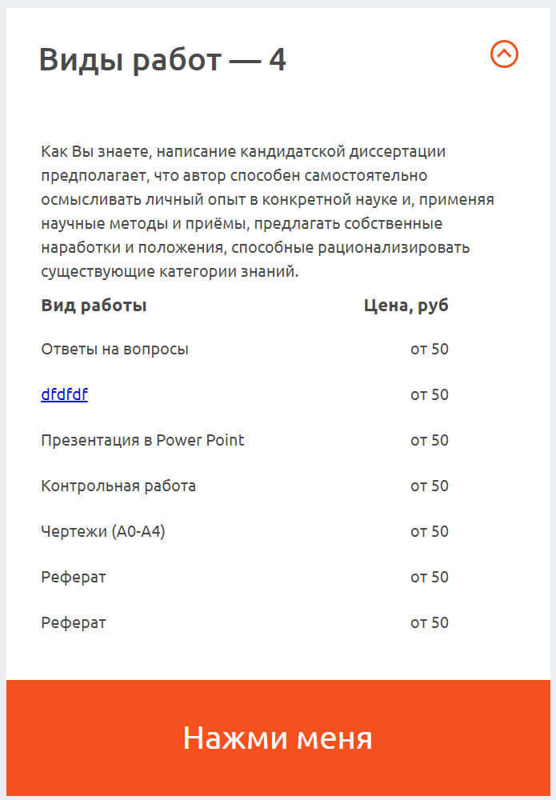

# Accordion

Состоит из одного раскрывающегося блока.
Может иметь кнопку внизу.

## Пример




## Параметры
### open
*boolean*

Задаёт изначальное состояние аккордеона - открыт или закрыт.

### title
*string*

Заголовок.

### button
*boolean*

Показывать ли кнопку внизу аккордеона.


### buttonLabel
*string*

Текст на кнопке внизу аккордеона.

### buttonURL
*string*

Куда ведёт кнопка внизу аккордеона.

### rows
Это массив со значениями, которые формируют строки таблицы.

Если запись состоит из двух элементов, например `["Ответы на вопросы", "от 50"],`,
то она создает строку таблицы, у которой первая колонка выравнивается по левому краю,
а вторая колонка - по правому. Используется для отрисовки прайсов с ценами.

Если в массиве один элемент, или это просто строка или react элемент,
то ячейка таблицы будет шириной в две колонки, а ее содержимое выравнивается
по левому краю.

Для отделения разделов одного аккордиона друг от друга можно использовать пустую строку (см. подробный пример).


## Пример использования
```jsx
<Accordion
    title="Виды работ — 4"
    rows={[
        ["Ответы на вопросы", "от 50"],
        [<a href="/dfdf">dfdfdf</a>, "от 50"],
        ["Презентация в Power Point", "от 50"],
        ["Контрольная работа", "от 50"],
        ["Чертежи (А0-А4)", "от 50"],
        ["Реферат", "от 50"]
    ]}
>
    Как Вы знаете, написание кандидатской диссертации предполагает
</Accordion>
```

## Подробный пример использования
```jsx
<Accordion
    title="Другие работы"
    button={true}
    buttonLabel="Нажми меня"
    buttonURL="/"
    rows={[
        ["Стандартный вуз", "12 000"],
        ["Колледж", "8 900"],
        ["", ""],
        <span style={{fontWeight: "bold"}}>Подготовка к консультации и защите</span>,
        "Пакет «Успешная Защита»",
        ["Консультация с автором"],
    ]}
>
    Как Вы знаете, написание кандидатской диссертации предполагает
</Accordion>
```

