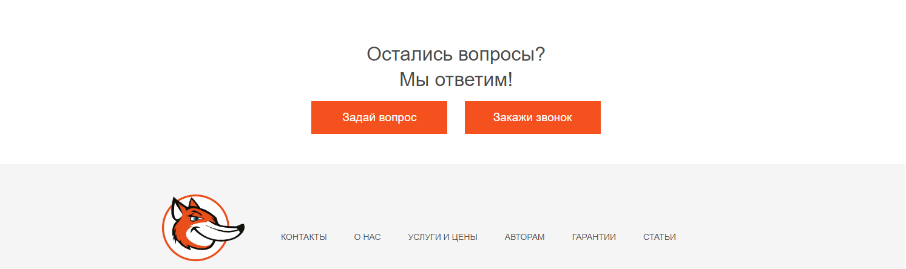
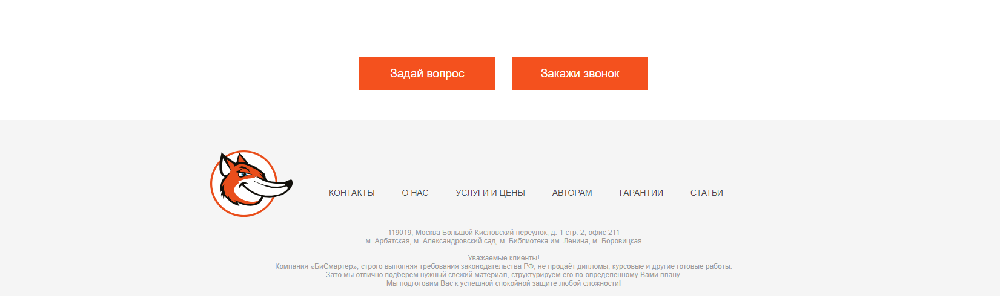

#CallAsk
Блок отображающий фрагмент футера

## Параметры
### isTitle
*boolean*

## Пример



###Пример использования
```js
  {!isTitle && 
    <React.Fragment>
      <Title className="title">Остались вопросы?</Title>
      <Title className="title">Мы ответим!</Title>
    </React.Fragment>
  }
  ```