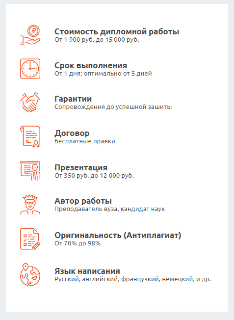

# Типы блоков

## InfoBlock
Это блок с иконками, однострочными тезисами и однострочным пояснением. Используется для перечисления коротких идей в текстовом виде.

### Пример


### Параметры
**infoBlockConfig**
infoBlockConfig это массив объектов с полями icon для икноки, title для главного текста и desc для дополнительного.

Формат простой:
```js
[
    { icon: icon_1, title: 'Стоимость дипломной работы', desc: 'От 1 900 руб. до 15 000 руб.' },
    { icon: icon_2, title: 'Срок выполнения', desc: 'От 1 дня; оптимально от 5 дней' },
    { icon: icon_3, title: 'Гарантии', desc: 'Сопровождения до успешной зашиты' },
    { icon: icon_4, title: 'Договор', desc: 'Бесплатные правки' },
    { icon: icon_5, title: 'Презентация', desc: 'От 350 руб. до 12 000 руб.' },
    { icon: icon_6, title: 'Автор работы', desc: 'Преподаватель вуза, кандидат наук' },
    { icon: icon_7, title: 'Оригинальность (Антиплагиат)', desc: 'От 70% до 98%' },
    { icon: icon_8, title: 'Язык написания', desc: 'Русский, английский, французкий, немецкий, и др.' },
]
```

### Пример использования
```js
import InfoBlock from 'components/common/InfoBlock';
import infoBlockConfig from 'components/config/infoBlockConfig'

<InfoBlock infoBlockConfig={infoBlockConfig}/>
```