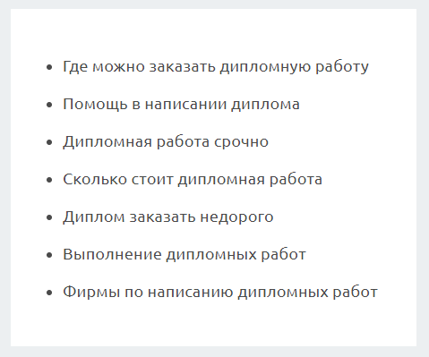

# LinksBlock


Список ссылок в конце страницы для тех, кто не нашел нужную информацию.

## Пример


## Параметры
### links
Массив ссылок
```jsx
[
    { url: "#", text: "Где можно заказать дипломную работу" },
    { url: "#", text: "Помощь в написании диплома" },
    { url: "#", text: "Выполнение дипломных работ" },
]
```

### Пример использования
```jsx
import links from 'data/linksBlockConfig';
<LinksBlock links={links}/>
```