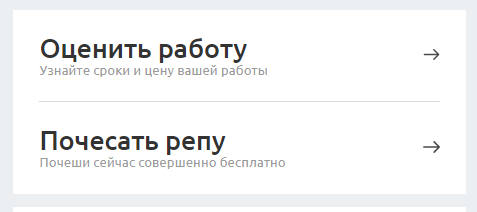

# NavRow

Это элемент блока с крупными ссылками. Используется только внутри `<section className="block-nav">`

## Пример


## Параметры
**title** *строка*

Крупный текст, основной текст ссылки.

**description** *строка*

Пояснение к ссылке.

**url** *строка*

Куда ведёт ссылка. Если это ссылка на анкор на этой же странице, то элемент
не будет иметь вокруг себя `<Link>`, а будет обычным `<a>` тегом, т.к. `<Link>`
не умеет переходить по хешу. Так-то. 

### Пример использования
```jsx
import BlockNav from 'components/common/BlockNav';
import NavRow from 'components/common/BlockNav/NavRow';

<BlockNav>
    <NavRow title="Оценить работу" description="Узнайте сроки и цену вашей работы" url='#'/>
    <NavRow title="Почесать репу" description="Почеши сейчас совершенно бесплатно" url='/'/>
</BlockNav>
```