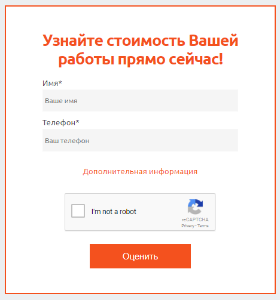

# OrderForm
Основаная форма. Может быть черной или красной (задаётся в параметрах).

## Пример



## Параметры
### title
*string*

Заголовок формы.

### buttonLabel
*string*

Текст кнопки.

### redForm
*boolean*

Определяет будет ли данная форма красной.

### formConfig

Описание всех полей.

#### label
Текст рядом с полем.

#### name
`name` под котороым придут данные с формы.

#### placeholder
Текст плейсхолдера.

#### required
Обязательно или нет данное поле. Обязательные поля показываются в краткой форме, а необязательные - в развёрнутой.

#### type
Тип поля. Возможные значения:
* text
* textarea
* dropdown
* file

```jsx
[
    {label: 'Имя', name: "name", type: 'text', placeholder: 'Ваше имя', required: true},
    {label: 'Тема', name: "theme", type: 'text', placeholder: 'Тема работы', required: false},
    {label: 'Вид работы', name: "worktype", type: 'dropdown', options: workTypeOptions, placeholder: 'Укажите подходящий тип работы', required: false},
    {label: 'Комментарии', name: "comment", type: 'textarea', placeholder: 'Ваши комментарии', required: false},
    {label: 'Прикрепить Файл', name: "file", type: 'file', placeholder: 'Добавить файл', required: false}
]
```

## Пример использования
```jsx
import OrderForm from 'components/common/OrderForm';
import {formConfig} from 'components/config/formConfig';

<OrderForm title="Узнайте стоимость Вашей работы прямо сейчас!"  buttonLabel="Оценить" formConfig={formConfig}/>
```