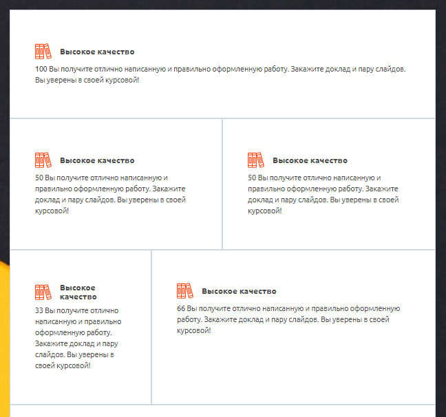
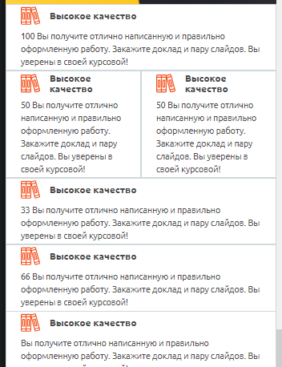

#QualityBlock

см. картинку

классы w33, w66 и w50 задают ширину элемента в процентах. см картинку и пример

## Пример
Широкий на десктопе


Узкий на планшете и телефоне


## Параметры
нет


### Пример использования
```jsx
import QualityBlock from "components/common/QualityBlock/index.js"

<QualityBlock 
  text={
    <ul>
      <li>Элемент 1</li>
      <li>Элемент 2</li>
    </ul>}
  title={<b>Заголовок</b>}
  path="/price"
  Class="w66"
  imageBlock = {}
/>
<QualityBlock 
  text={
    <ul>
      <li>Элемент 1</li>
      <li>Элемент 2</li>
    </ul>}
  title={<b>Заголовок</b>}
  path="/price"
  Class="w33"
  imageBlock = {}
/>
<QualityBlock 
  text="Текст"  
  title="Заголовок"
  path="/price"
  Class="w50"
  imageBlock = {}
/>
```