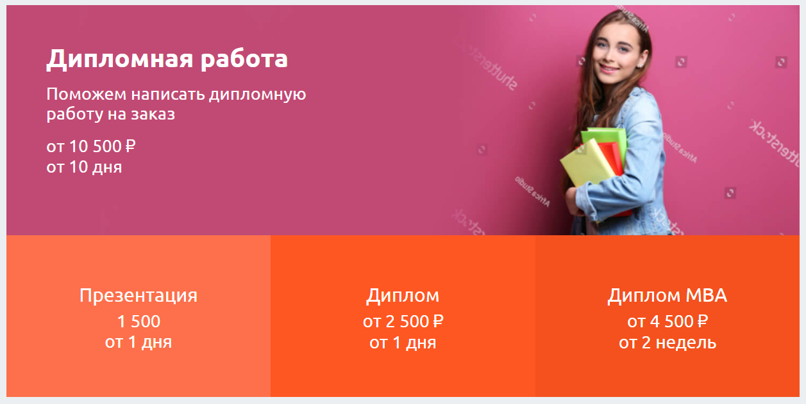
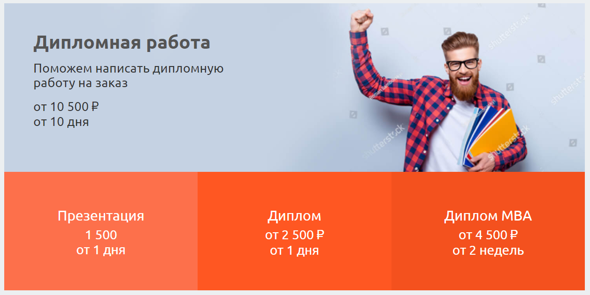
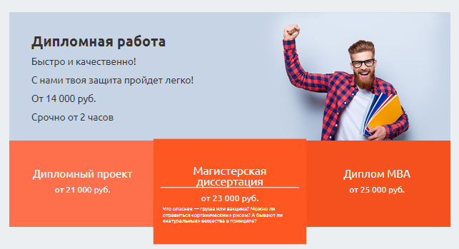

# Блок с красными кнопками
Блок с картинкой, текстом и красными кнопками под ним.
Особенности:

* весь кликабельный
* текст от левого края
* картинка от правого края выстраивается сама
* автоматическая высота
* число кнопок от 1 до 5

## Пример




Пример с активированной кнопкой и текстом


## Параметры
**color** цвет текста на верхней части с картинкой.

**url** куда ведёт верхняя часть

**image** картинка верхней части

**gradient** градиент, который отвечает за прочтение текста, когда текст наползает
на человека справа.

**title** заголовок верхней части

**text** текст верхней части

```jsx
<ServiceBlock
    color="#333333"
    url="/diplom-na-zakaz"
    image={require('static/images/block/j.jpg')}
    gradient="rgba(199, 212, 229, 0.75)"
    title="Дипломная работа"
    text={<div>
        <p>Быстро и качественно!</p>
        <p>С нами твоя защита пройдет легко!</p>
        <p>От 14 000 руб.</p>
        <p>Срочно от 2 часов</p>
    </div>}
    cards={[
        [
            servicecards["Дипломный проект"],
            servicecards["Магистерская диссертация"],
            servicecards["Диплом MBA"],
        ],
    ]}
/>
```
