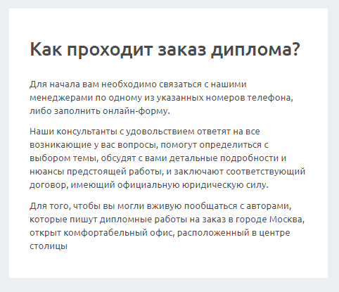

# Текстовый блок

Несколько абзацев текста, объединённые в один блок. Это `section` с классом `block-text`

## Пример


## Параметры
Нет

## Элементы
**Заголовок**
`<h2 className="block-text__title">`

**Абзац**
`<p className="block-text__par">`

**Список**
`<ul className="block-text__list2">`

### Пример использования
```js
<section className="block-text">
    <h2 className="block-text__title">
        Дипломная работа на заказ
    </h2>
    <p className="block-text__par">
        Хотите заказать дипломную работу, но не знаете, куда следует обратиться?
    </p>
    <p className="block-text__par">
        Не желаете тратить большое количество времени на самостоятельную разработку заданной темы, и хотите заказать диплом у профессионалов?
    </p>
</section>
```